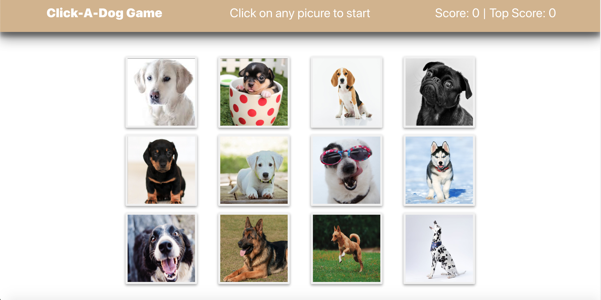
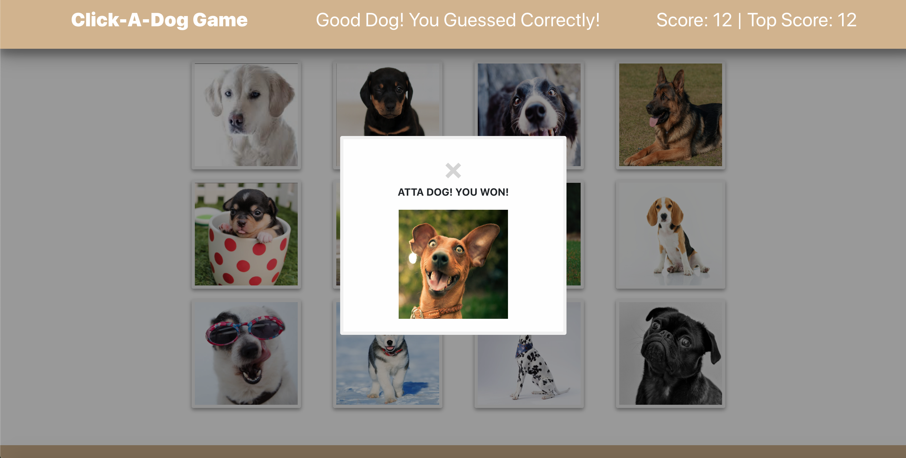
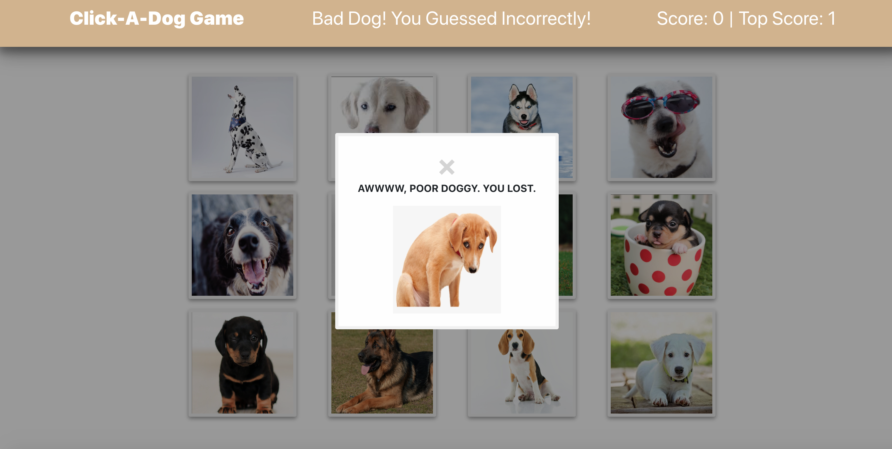

# Click-A-Dog Game

This project is a front-end React app that functions as an image memory game.

## Tools used
React, Reactstrap, shuffle-array npm package

## Playing the game
Navigate to the app's homepage: https://click-a-dog.herokuapp.com/

There are 12 clickable images. Users click on an image to gain a point.

The goal of the game is to click all 12 images without clicking on any twice; if the user does this then the user wins the game.

If the user clicks the same image more than once, the current score is reset to zero and the user loses the game.

